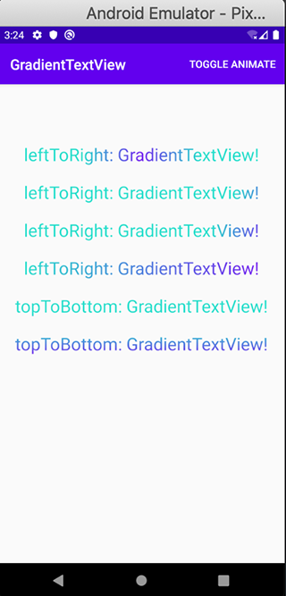

# GradientTextView [](https://bintray.com/williamyang/maven/gradienttext/1.0.0/link)

### 🔥🔥🔥用于设置TexView的字体 *渐变颜色*、*渐变方向* 和 *动画效果*

### 效果预览：

 

### 一、控件样式

```xml
<declare-styleable name="GradientTextView">
    <attr name="gradient_startColor" format="reference|color" />
    <attr name="gradient_endColor" format="reference|color" />
    <attr name="gradient_direction" format="enum">
        <enum name="leftToRight" value="1" />
        <enum name="topToBottom" value="2" />
    </attr>
    <attr name="gradient_animate" format="boolean" />
    <attr name="gradient_speed" format="enum">
        <enum name="slow" value="20" />
        <enum name="normal" value="10" />
        <enum name="fast" value="5" />
    </attr>
</declare-styleable>
```

### 二、属性介绍

| 属性                 | 可选值                                    | 作用                            |
|:--------------------|:-----------------------------------------|:-------------------------------|
| gradient_startColor | 值在color.xml中定义                        | 渐变颜色的起始值(默认值：#6200EE)   |
| gradient_endColor   | 值在color.xml中定义                        | 渐变颜色的结束值(默认值：#03DAC5)   |
| gradient_direction  | leftToRight：从左向右，topToBottom：从上向下 | 渐变颜色的方向(默认值：leftToRight) |
| gradient_animate    | true or false                            | 渐变颜色的动画开关(默认值：false)   |
| gradient_speed      | slow、normal、fast                       | 渐变颜色的动画速度(默认值：normal)   |

### 三、控件在布局中使用

```xml
<com.william.gradient.GradientTextView
    android:id="@+id/gradientTextView"
    android:layout_width="wrap_content"
    android:layout_height="wrap_content"
    android:layout_marginTop="20dp"
    android:text="@string/leftToRight_GradientTextView"
    android:textSize="24sp"
    app:gradient_animate="true"
    app:gradient_direction="leftToRight"
    app:gradient_speed="normal" />
```

### 四、在代码中控制动画开关

```kotlin
gradientTextView.apply {
    translateAnimate = !translateAnimate
    invalidate()
}
```

